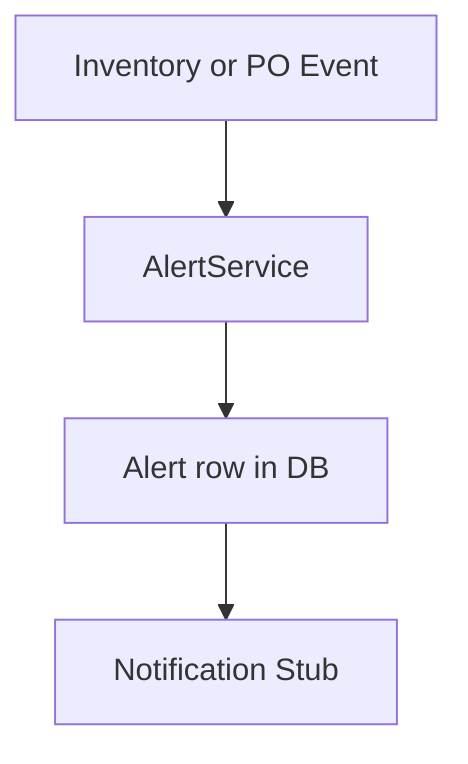

### Alert Workflow

### Rules

- Critical alerts for out-of-stock transitions.
- Info alerts for stock receipts.
- Future integrations can send email or webhooks from `AlertService.sendNotification`.

