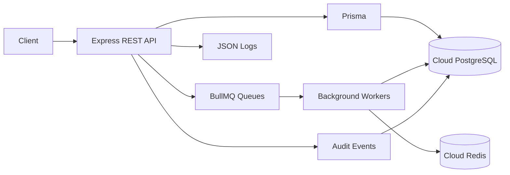

### Architecture Overview

**Context**: Backend-only inventory replenishment system with cloud PostgreSQL and Redis.

### Folder Structure

- `packages/backend/src`
  - `app.ts` Express app
  - `server.ts` HTTP server
  - `config.ts` env config
  - `logging.ts` JSON logger and correlation ids
  - `prismaClient.ts` Prisma client and advisory locks
  - `routes/` HTTP route handlers
  - `services/` domain services
  - `queues/` BullMQ queues and workers
  - `worker/` worker entrypoint
  - `scripts/` tooling such as concurrency simulation
- `packages/backend/prisma`
  - `schema.prisma` database models
- `packages/shared/src`
  - Shared TypeScript types

