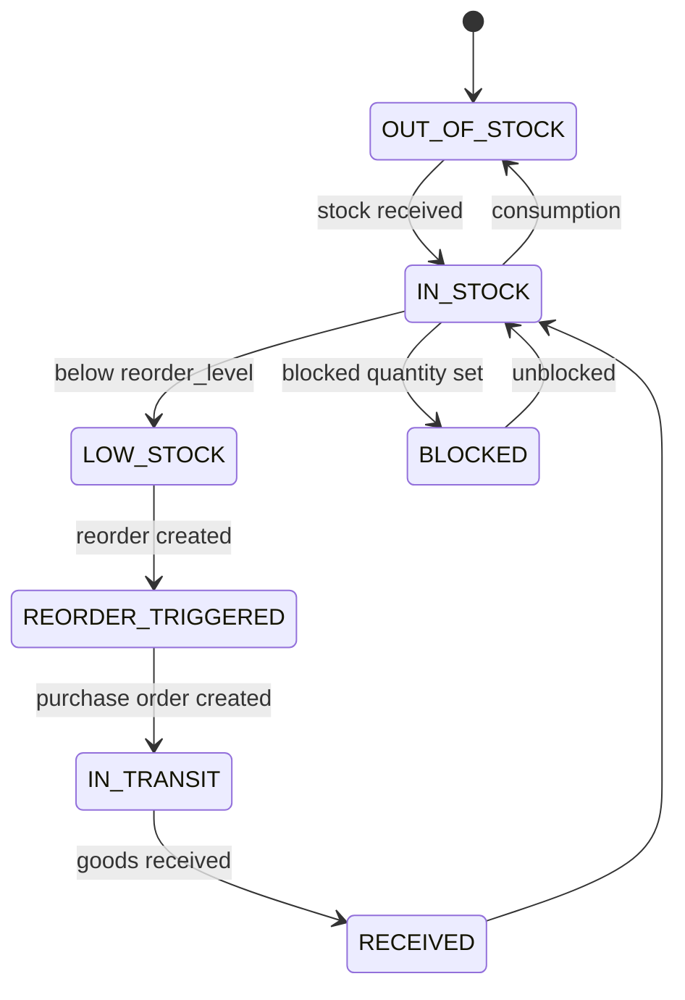

### Inventory State Machine

### Enforcement

- Inventory rows persist a `state` field.
- All inventory mutations compute next state based on quantities and blocked amount.
- `InventoryStateHistory` stores `(from_state, to_state, changed_at, meta)` for each transition.

### Rules

- Negative inventory is rejected.
- State transitions are only applied inside database transactions.

